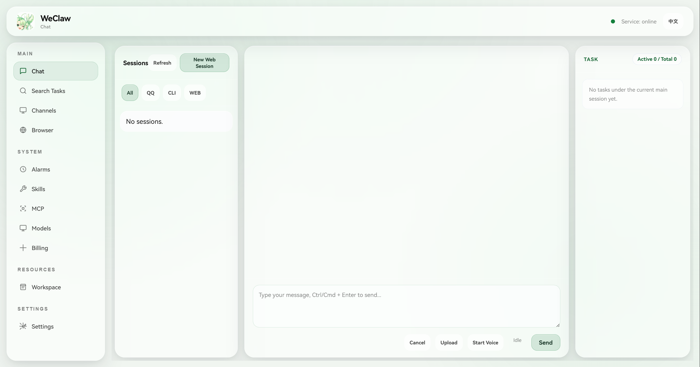

<div align="center">
  <h1>WeClaw：手机 与 Windows 协同的个人助手</h1>
  <p>
    
    
  </p>
</div>

[English README](./README.md)

首个国产版 OpenClaw 跨端个人助手 Agent。面向 Windows 电脑设计，打通手机端 QQ 与 Windows 端能力，让用户通过自然语言实现跨端自动规划与执行任务的闭环。

## GUI 界面预览

<div align="center">
  
</div>

## 时间线

- **2026-02-03** 🎉 WeClaw 智能体开源啦，欢迎使用！
- **2026-02-23** 🖥️ 新增图形化 **Agent 控制台**（`WeClaw_console/`），支持统一管理与可视化操作：
  - 聊天（SSE 流式 + ReAct 过程追踪）
  - 语音输入（浏览器端录音 + 本地转写）
  - 搜索任务（会话检索与上下文定位）
  - 频道（Web / CLI / QQ / Discord）
  - Plugin Channel Host（workspace 安装的 TypeScript channel runtime）
  - 定时任务（Cron）与心跳（Heartbeat）
  - Skills 管理
  - 模型配置与切换
  - 模型计费与调用审计（Token 统计）
- **2026-03-07** 🔌 新增一整套 **MCP** 能力：
  - 本地与远程 MCP Client 运行时
  - 在 Web Console 中支持 MCP 的发现、配置与运行时管理
- **2026-03-09** 🚪 围绕 **Web Console** 统一了项目启动入口：
  - 新增 `entry_weclaw_console.py` 作为推荐根入口
  - 新增 `python -m WeClaw_console` 包启动方式
- **2026-05-08** 💬 新增 **自由对话** 能力：
  - 支持在不创建明确任务的情况下直接与 Agent 连续交流
  - 通过主会话 / 任务会话机制区分开放式对话与可执行任务
  - 对话过程中可自然切换到任务执行，并保留上下文衔接

## 核心亮点

- 跨端个人助手：手机 QQ ↔ Windows PC 协同
- 多智能体架构：支持复杂任务并行拆解与推进
- 智能路由：根据任务复杂度自动选择 `ReAct` 或 `ReCAP`
- 上下文工程：压缩、卸载与文件系统协同，降低上下文溢出风险
- 安全沙箱与异步执行：提升长链路任务执行稳定性
- Skills 集成机制：支持能力扩展与个性化配置
- 自由对话与任务会话并行：日常交流和可执行任务可以自然切换
- 任务状态管理：支持复杂任务的多轮自动执行
- 执行策略清晰：先规划、再行动

## 演示动图

<table align="center">
  <tr align="center">
    <th><p align="center">🔎 信息检索与报告生成</p></th>
    <th><p align="center">⏰ 定时任务与自动化执行</p></th>
    <th><p align="center">🧩 Skills 自动生成</p></th>
    <th><p align="center">💻 编程与远程执行</p></th>
  </tr>
  <tr>
    <td align="center"><p align="center"></p></td>
    <td align="center"><p align="center"></p></td>
    <td align="center"><p align="center"></p></td>
    <td align="center"><p align="center"></p></td>
  </tr>
</table>

## 能力概览

- 信息检索与整理
- 报告与文档生成
- 定时任务与自动化执行
- 跨端开发与代码任务执行

## 图形化 Agent 控制台

项目已提供本地图形化控制台 `WeClaw_console/`，用于统一管理 Agent 的核心运行能力。控制台默认仅监听 `127.0.0.1`，适合本机开发和运维场景。

主要功能包括：

- 聊天：自由对话、任务会话管理、流式输出、工具调用过程可视化
- 语音输入：浏览器端录音后本地转写为文本（支持中英文）
- 搜索任务：跨会话检索并快速定位相关上下文
- 频道：统一配置与查看 Web / CLI / QQ / Discord / Plugin Channel Host 渠道状态
- 定时任务与心跳：支持周期任务、即时触发与状态管理
- Skills：从工作目录发现并展示可用技能
- 模型：配置多 Provider/Profile，并切换当前工作模型
- 模型计费：查看调用量、Token 消耗、失败率与调用明细

### 推荐启动方式

现在推荐把 Web Console 作为项目主入口来启动：

```powershell
python entry_weclaw_console.py
```

也支持包方式启动：

```powershell
python -m WeClaw_console
```

启动后在浏览器打开 `http://127.0.0.1:7788`。

推荐使用流程：先进入 Web Console，再在 `Channels` 页面管理 CLI / QQ / Discord。

如果启用 `Plugin Channel Host`，WeClaw 会在首次启动时把 Node 运行时准备到 `~/.weclaw/agents/<agent_id>/runtime/plugin_channel_host/`，不依赖源码目录中提交的 `node_modules/` 或 `dist/`。

直接渠道脚本依然保留，适合高级或单渠道用法：

```powershell
python channels/cli.py
python channels/adapters/qq.py
python channels/adapters/discord.py
```

## 适用场景

- 工作/学习资料的快速搜集与结构化整理
- 报告、清单、摘要等内容自动生成
- 需要跨端协作的多步骤任务
- 个人开发流程与脚本自动化

## 运行前准备

普通使用场景下，建议在 Web Console 的 `模型` 页面配置 Provider/Profile、API Key 和当前启用模型。环境变量与 `~/.weclaw/agents/<agent_id>/runtime/secrets.yaml` 主要用于首次启动、无界面运行或手动恢复配置。

环境变量：

- `LLM_API_KEY`（必填，用于模型调用）
- `LLM_BASE_URL`（可选；默认值由 `LLM_PROVIDER` 决定）
- `LLM_MODEL`（可选；默认值由 `LLM_PROVIDER` 决定）
- `LLM_PROVIDER`（可选，`openai|anthropic|dashscope`，也可自动识别）
- `BRAVE_API_KEY`（可选，用于网页搜索）
- `ZHIPU_API_KEY`（可选，用于网页搜索）
- `BOTPY_APPID`（必填，QQ 入口需要）
- `BOTPY_SECRET`（必填，QQ 入口需要）
- `WE_CLAW_HOME`（可选，WeClaw 全局状态根目录，默认 `~/.weclaw`）

### Agent 运行时密钥文件

请创建 `~/.weclaw/agents/<agent_id>/runtime/secrets.yaml` 并填写密钥。如果设置了 `WE_CLAW_HOME`，请把 `~/.weclaw` 替换为对应的状态根目录：

```yaml
LLM_API_KEY: ""
LLM_BASE_URL: ""
LLM_MODEL: ""
LLM_PROVIDER: ""
ZHIPU_API_KEY: ""
BOTPY_APPID: ""
BOTPY_SECRET: ""
```

说明：QQ 机器人的 `APPID` 与 `SECRET` 请在腾讯 QQ 开放平台注册并创建机器人后获取：https://q.qq.com/#/

## 运行

### Web Console（推荐）

```powershell
python entry_weclaw_console.py
```

或：

```powershell
python -m WeClaw_console
```

启动后打开 `http://127.0.0.1:7788`。

### CLI

```powershell
python channels/cli.py
```

### QQ 私聊

```powershell
python channels/adapters/qq.py
```

### Discord

```powershell
python channels/adapters/discord.py
```

## 目录结构

- `channels/adapters/qq.py`：QQ 私聊入口
- `channels/cli.py`：CLI 入口
- `core/agent/bot_runtime.py`：机器人核心逻辑
- `integrations/`：MCP、检索、浏览器、计费与 LLM 接入层
- `tools/`：工具能力
- `skills/`：仓库内置默认 skill 模板，首次使用时会复制到 workspace 私有 skills 目录

为新的 Web Console 启动流补充的入口文件：

- `entry_weclaw_console.py`：浏览器控制台统一入口
- `channels/`：CLI / QQ / Discord 的直接入口目录

## 开发与扩展

- 在 `~/.weclaw/agents/<agent_id>/skills/local/` 中新增或修改技能
- 在 `tools/` 中新增工具能力
- 通过统一 Skills 机制做个性化扩展

## 许可证

MIT
